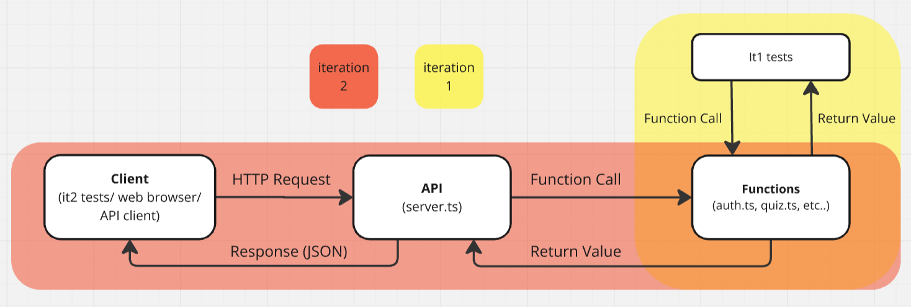

# Tutorial 4

[TOC]

## A. Intro to Typescript & Types

1. Open [package.json](./a.typescript/package.json) and look through `"scripts"`,  `"dependencies"` and `devDependencies` (if they exist). Install the packages if not already.
    > NOTE:<br/>
    > ts-node is similar to node - it allows us to execute *.ts files directly
    > (without having to 'compile' them into javascript using 'tsc')
    >
    > tsc has been added as a script in [package.json](./a.typescript/package.json) with the noEmit flag. This means it won't produce an output file when run. We can use it as a type checker instead.
    >
    > @types/jest is the type definitions for the jest library. Generally for typescript, when we install a
    > library, we should try to also install @types/library if it exists.


In [types.js](a.typescript/types.js) lies some basic functions:

### Interface: Functions
<table>
  	<tr>
    	<th>Name & Description</th>
    	<th>Parameters</th>
    	<th>Return Type</th>
    	<th>Errors</th>
  	</tr>
  	<tr>
    	<td>
    	    <code>sum</code><br>
    	    Given 2 numbers, return the sum.
    	</td>
    	<td>
    	    (num1: <code>number</code>, num2: <code>number</code>)
    	</td>
    	<td>
    	    <code>number</code>
    	</td>
    	<td>
    	    N/A
    	</td>
  	</tr>
  	<tr>
    	<td>
    	    <code>isEven</code><br>
    	    Given a number, return true if it's even and false if it's odd.
    	</td>
    	<td>
    	    (num: <code>number</code>)
    	</td>
    	<td>
    	    <code>boolean</code>
    	</td>
    	<td>
    	    N/A
    	</td>
  	</tr>
  	<tr>
    	<td>
    	    <code>sumArray</code><br/>
    	    Given an array of numbers, return the sum of all numbers in the array.
    	</td>
    	<td>
    	    (numbers: <code>number[]</code>)
    	</td>
    	<td>
    	    <code>number</code>
    	</td>
    	<td>
    	    N/A
    	</td>
  	</tr>
  	<tr>
    	<td>
    	    <code>createUser</code><br/><br/>
    	    Given an email and a name, create a user object and return an userId for that user.
    	</td>
    	<td>
    	    (email: <code>string</code>, name: <code>string</code>)
    	</td>
    	<td>
    	    <code>UserId</code>
    	</td>
    	<td>
    	    <code>Error</code> if email or name is an 	empty string.
    	</td>
  	</tr>
  	<tr>
    	<td>
    	    <code>getUser</code><br/><br/>
    	    Given an userId, return information about a user.
    	</td>
    	<td>
    	    (userId: <code>number</code>)
    	</td>
    	<td>
    	    <code>UserInfo</code>
    	</td>
    	<td>
    	    <code>Error</code> if userId does not correspond to an existing user.
    	</td>
  	</tr>
</table>

### Interface: Data Types
<table>
  <tr>
    <th>Interface</th>
    <th>Structure</th>
  </tr>
  <tr>
    <td>
        <code>UserId</code>
    </td>
    <td>
        Object containing key
<pre>{
    userId: number,
}</pre>
    </td>
  </tr>
  <tr>
    <td>
        <code>UserInfo</code>
    </td>
    <td>
        Object containing keys
<pre>{
    userId: number,
    name: string,
    email: string,
}</pre>
    </td>
  </tr>
  <tr>
    <td>
        <code>Error</code>
    </td>
    <td>
        Object containing key
<pre>{
    error: string,
}</pre>
    </td>
  </tr>
</table>

### Task

1. At the bottom of [types.js](a.typescript/types.js),
    - what will happen if these functions were supplied with invalid (e.g. wrong type), missing or extra arguments?

    - run the program with:
        ```shell
        $ node types.js
        ```
        Discuss the results

2. Rename the `types.js` file to `types.ts` and add type annotations to the functions, constants and variables as needed. Create interfaces as needed for more complex types.

    i) After adding type annotations, why does our program still error at  this line of code? <br>
    ```js
    let user1 = createUser('valid@email.com', 'user1');
    console.log(user1);
    console.log(getUser(user1.userId));
                          //  ^ Property 'userId' does not exist on type 'UserId | Error'.
    ```

3. What will happen to the invalid console.log statements now when we attempt to compile the program using `tsc` or execute it with `ts-node`
    ```shell
    $ npm run tsc types.ts
    $ npm run ts-node types.ts
    ```

4. (Optional) Remove function return types and re-execute/compile your code. Discuss your observations.

5. (Optional) Why do we need to type the constant `users` but not `id`?

5. (Optional) Rewrite the UserInfo interface so that it extends the UserId interface. Why would we want to do this?

## B. APIs

What is an API?

Below are some examples of real-world APIs that are publicly available for everyone to use!
  - [🎼 Spotify](https://developer.spotify.com/documentation/web-api/reference/#/)
    - and a cool [example](https://everynoise.com/) of how the Spotify API can be used in a project
  - [🎥 IMDb](https://imdb-api.com/api)
  - [💰 Stocks/Finance](https://finnhub.io/docs/api/introduction)
  - [🦎 Pokemon](https://pokeapi.co/)

For a more comprehensive list of free APIs for use in software and web development, see:
- https://github.com/public-apis/public-apis

You will be building an API based on the swagger.yaml file in your project repository!

## C. HTTP Servers

We deploy our APIs on HTTP servers which can process HTTP requests and responses.


### Requests

1. What information might we need in a HTTP request? 

2. Which HTTP method would we use for each of these functions:

    1. adminAuthRegister
    2. adminUserDetails
    3. adminUserPasswordUpdate
    4. adminQuizList
    5. adminQuizCreate
    6. adminQuizRemove
    7. adminQuizNameUpdate
    8. clear

3. What types of HTTP request do we use query parameters, path parameters, and/or request bodies?

### Responses

1. What information might we get in a HTTP response?

2. What does each of the below status code mean or tell you about the state of the request?
    1. 200
    2. 400
    3. 401
    4. 403
    5. 404
    6. 500

### Sending Requests

1. How can we send HTTP requests?

2. In an API client, create valid and invalid requests to one of the APIs given above (eg: send a GET request to https://pokeapi.co/api/v2/pokemon/ditto). After each request, take a look at the response body and status codes.

## D. Linting

Below is a piece of software written by a COMP1531 tutor back when they were still a newbie programmer in COMP1511. This was the interface that they followed:

### Interface: Functions

<table>
  <tr>
    <th>Name & Description</th>
    <th>Parameters</th>
    <th>Return Type</th>
    <th>Error</th>
  </tr>
  <tr>
    <td>
        <code>drawX</code><br/><br/>
        Return a string that contains an x of a certain size, made up of smaller x-es.<br/>
        There should be no trailing white spaces.
    <td>
        (size)
    </td>
    <td>
        <code>string</code>
    </td>
    <td>
        Return the string <code>'error'</code> if the given <code>size</code> is not an odd number.
    </td>
  </tr>
</table>

1. Without modifying the code, review the `drawX` function in [x.ts](d.linting/x.ts), what are some styling/design issues?

1. Open `package.json` and look through `scripts`,  `dependencies` and `devDependencies`. Install them if not already!

1. Use `eslint` to identify any linting issues.

1. Use `eslint` to auto-fix most issues.

1. Fix any remaining issues manually and refactor the code if applicable.