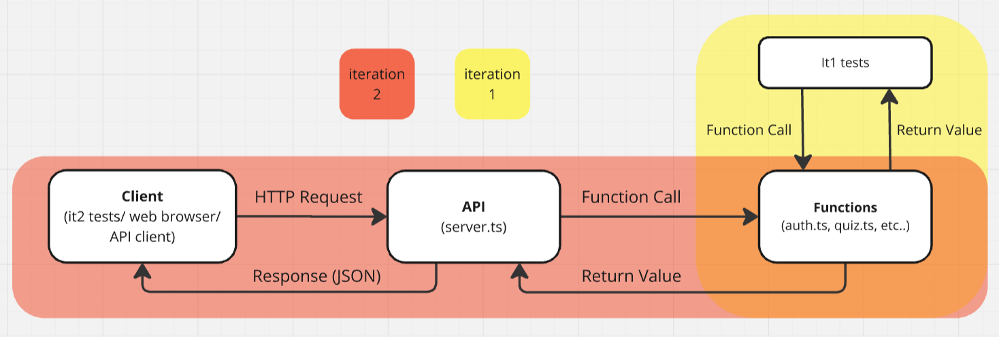

# Tutorial 5

[TOC]

## A. Express Server Build

Before we get started, here is a diagram that you can reference when transitioning from iteration 1 to iteration 2:

<details close>
<summary>click to view</summary>



</details>

### API documentation

From iteration 2 onwards, the specification will be written in swagger.

A [swagger.yaml](a.express/swagger.yaml) file is also available for this tutorial exercise.

Open the rendered file (e.g. on GitLab) and explore the inputs/outputs.

> Play around, toggle between `Example Value | Model` in each route, etc

### Part 1 - Setting up

1. Open [a.express/package.json](a.express/package.json) and look through `"scripts"`,  `"dependencies"` and `devDependencies`. Install the packages if not already.
    > ```shell
    > $ npm install
    > ```
    > Note: [ts-node-dev](https://www.npmjs.com/package/ts-node-dev) is a useful debugging tool that automatically restarts server when changes are made to the code.


### Part 2 - Building the backend

The implementation details have been completed as functions in the file [a.express/src/people.ts](a.express/src/people.ts), similar to your major project's iteration 1.

1. Your tutor will demonstrate how you can implement the `/people/add` and `/people/list` server route by reusing and wrapping around the existing functions in [a.express/src/people.ts](a.express/src/people.ts).
    > A hackmd template has been provided for optional use (for group collaboration)   

1. In groups, complete the remaining routes in [a.express/src/server.ts](a.express/src/server.ts) by following the steps below:
    1. identify the appropriate `HTTP` method (POST/GET/PUT//DELETE)
    1. identify the input parameter type (Query/Body)
    1. implement your assigned route as a wrapper around the corresponding function.

### Part 3 - HTTP Tests

In [people.test.ts](a.express/src/people.test.ts), some tests have been provided for functions `clear`, `peopleAdd`, `peopleList` and `personView`. These tests currently call each function directly, similar to your iteration 1 tests.   

As a class, convert these tests to make requests to the server (instead of calling the function directly)
> This process is similar to what you will need to do to convert your tests for iteration 2         

For each function:
1. Use the `model` button in the swagger file to find the types for the variables
2. Write a `request` to the server for this route
3. Convert the existing tests to use the server request

### Part 4 - Testing

Run the server and tests on two different terminals and observe the output and results.

For manual debugging, a frontend for our application is also available at:
- https://comp1531frontend.gitlab.io/namesages

> Consider also opening the backend server url in a browser and/or using an API client such as ARC, Insomnia or Postman. On VLAB, these applications can be accessed by:
> - 1531 arc
> - 1531 insomnia
> - 1531 postman


### Part 5 - HTTP Errors

Currently, all errors return the status code 400. Consider the modified interface for `/people/add`, which now has both 400 and 401 status codes for errors:

<table>
  <tr>
    <th>Name & Description</th>
    <th>HTTP Method</th>
    <th>Data Types</th>
    <th>Errors</th>
  </tr>
  <tr>
    <td>
      <code>/people/add</code><br/><br/>
      Given a name and an age, add the entry into the data store if it is valid.
    </td>
    <td>
        ???
    </td>
    <td>
      <b>??? Parameters</b><br/>
      <code>{name: string, age: number}</code>
      <br/><br/>
      <b>Return Object</b><br/>
      <code>{}</code>
    </td>
    <td>
      Return <code>{ error }</code> with status code `401` when:
      <ul>
        <li>
          The given name is an empty string, <code>""</code>.
        </li>
      </ul>
      Return <code>{ error }</code> with status code `400` when:
      <ul>
        <li>
          The given age is not strictly positive.
        </li>
        <li>
          The given name already exists in the data store.
        </li>
      </ul>
    </td>
  </tr>
</table>

As a class, discuss some ways you might be able to modify the existing code to implement this new interface.
