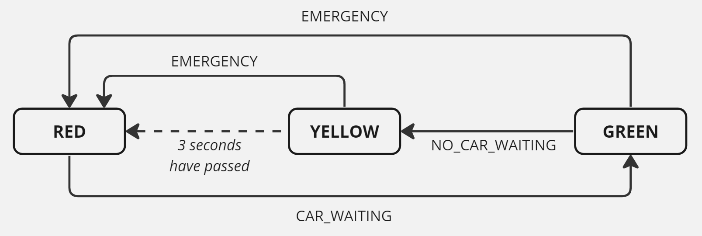

# Tutorial 8

[TOC]

## A. Zune bug - Using Coverage

Below is a piece of code that you may remember from a previous week's activity:
```ts
const ORIGIN_YEAR = 1970;

const isLeap = (y: number) => new Date(y, 1, 29).getDate() === 29;

export const dayToYear = (days: number) => {
  let year = ORIGIN_YEAR;
  while (days > 365) {
    if (isLeap(year)) {
      if (days > 366) {
        days -= 366;
        year += 1;
      } else {
        continue;
      }
    } else {
      days -= 365;
      year += 1;
    }
  }
  return year;
};
```

1. What is code coverage and how it can be useful?

1. Run the current tests in [a.zunebug/day-to-year.test.ts](a.zunebug/day-to-year.test.ts) with the `--coverage` option from `jest`.
Open the resulting `html` file in your browser. How can we interpret this result?   

1. Write a test case to achieve 100% coverage.

1. Make any modifications to the program as appropriate.


## B. System Model - State Diagram

Below is a state diagram that describes the states and subsequent transitions that would occur for a grocery store checkout system (from the perspective of the user-machine interaction). Note that:
- the circles represent `states` that the system is in
- the arrows between the circles represent `actions` that the user does to transition the system from one state to another

<details close>
<summary>click to view</summary>


</details>

### Task
In groups, create a state diagram that describes the states and transitions that might occur in a game of 'hide and seek tag', from the perspective of the seeker.    

The simplified rules to hide and seek tag are:
- Game starts with one seeker, and all other players hiding
- When the seeker spots somebody, they must tag them
- Players who get tagged join the game as an additional seeker

Consider how you could turn this into a state diagram, from seekers perspective. Some possible states and actions you could consider are:
- `States` (of the seeker): searching, suspicious, chasing
- `Actions` (of the player): player is visible, player runs away, player is hidden

Spend 10-15 minutes in groups designing the state diagram for this game. You are not limited to the above states and actions (so be creative!). You should aim to make the game as balanced as possible between the seekers and the players.

## C. Traffic Lights

Now that we've looked at how to illustrate a state machine, we'll look at how to turn one into code!

Below is a state diagram that represents a simple traffic light system. This system has three states (RED, YELLOW, GREEN), and three actions (CAR_WAITING, NO_CAR_WAITING, EMERGENCY) that are used to move between the states.



This state diagram is to be implemented in [traffic.ts](c.traffic/traffic.ts), using the function `updateLight` to transition between states. Each time the state is changed, it should print to terminal `"Light has changed to 'STATE'"`.

<table>
  <tr>
    <th>Name & Description</th>
    <th>Input Parameters</th>
    <th>Returned Object</th>
    <th>Errors</th>
  </tr>
  <tr>
    <td>
      <code>updateLight</code>
      <br/><br/>
      <ul>
      <li>Updates the state of the traffic light (following the state diagram).</li>
      <li>It should print each state change to the terminal (eg. 'Light has changed to "RED"') </li>
      </ul>
    </td>
    <td>
        (action)
    </td>
    <td>
        <code>{}</code>
    </td>
    <td>
        Throw <code>{error}</code> when:
        <ul>
          <li>provided action is not valid for the current system state</li>
        </ul>
    </td>
  </tr>
</table>

### Task
In groups or as a class, use the state diagram to complete the function `updateLight` in [traffic.ts](c.traffic/traffic.ts). 

> To complete this function, we will need a way to implement some sort of timer. To do this, we are going to be using [setTimeout](https://developer.mozilla.org/en-US/docs/Web/API/setTimeout) and [clearTimeout](https://developer.mozilla.org/en-US/docs/Web/API/clearTimeout).    
> View this page for more information and example usage: https://www.geeksforgeeks.org/explain-cleartimeout-function-in-node-js/

Once you think your function is correct, you can test it by running the main program.
  > To run the main program:
  > ```shell
  > $ npm run ts-node ./src/main.ts
  > ```
  >
  >
  > You should expect the following terminal output:
  > ```
  > Cycle 1:
  > Light has changed to GREEN
  > Light has changed to YELLOW
  > Light has changed to RED
  >
  > Cycle 2:
  > Light has changed to GREEN
  > Light has changed to YELLOW
  > Light has changed to RED
  > ```
  > IMPORTANT: For cycle 2, you should notice a 3 second delay before the light changes to RED. 

A test suite has also been provided, which can be used to check the correctness of your code.


