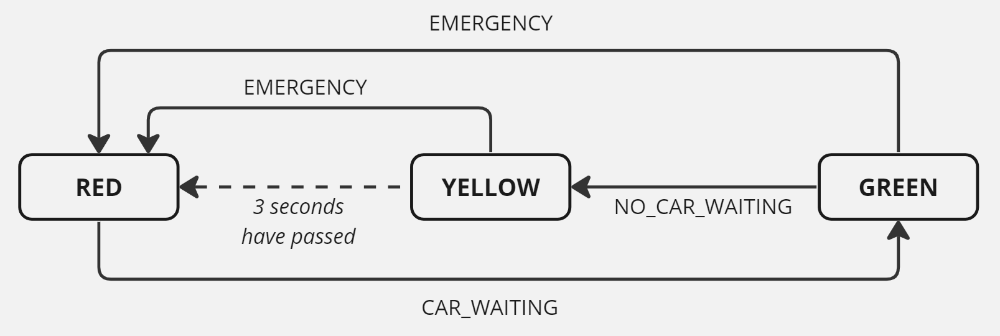

# Tutorial 9

[TOC]

## A. User Stories

Consider the core requirements of UNSW Treats (like Microsoft Teams, but for UNSW):

Ability to:
1. Register, login and log out
1. See a list of channels
1. Create a channel, join a channel, invite someone else to a channel, and leave a channel
1. Within a channel, view all messages, view the members of the channel, and the details of the channel
1. Within a channel, send a message now, or send a message at a specified time in the future
1. Within a channel, edit, share between channels, remove, pin, unpin, react, or un-react to a message
1. View anyone's user profile, and modify one's profile (name, email, handle, and profile photo)
1. Search for messages based on a search string
1. Modify a user's admin permissions: (MEMBER, OWNER)
1. Send a message directly to a user (or group of users) via direct messaging (DM).

Pick **one** of the above and write a series of user stories that encompass each requirement:

1. Discuss as a class the potential target audience, and use this as your type of user;
* Write acceptance criteria for each story and discuss when to use Scenario-based and Rule-based acceptance criteria

## B. Use Cases

Pick **one** of the above requirements you have written stories for and write a use case for the flow of interaction.

## C. Routes

Break into random teams of 3.

In your team, you will have 5 minutes to (as a team) propose one or more new "route(s)" (i.e. URL) that could be added to UNSW Treats to add some cool functionality to the product.

Find something that you as a team get excited about. You'll be sharing your answer with the class, and will be expected to provide for each route:
- A route (i.e. /this/URL/name)
- A CRUD method (e.g. GET)
- Input parameters
- Return object
- Description of what it does

## D. Traffic lights - Debugging

Below is the diagram and interface that was used for the traffic light example in last weeks tutorial:

click to view

<table>
  <tr>
    <th>Name & Description</th>
    <th>Input Parameters</th>
    <th>Returned Object</th>
    <th>Errors</th>
  </tr>
  <tr>
    <td>
      <code>updateLight</code>
        
      <ul>
      <li>Updates the state of the traffic light (following the state diagram).</li>
      <li>It should print each state change to the terminal (eg. 'Light has changed to "RED"') </li>
      </ul>
    </td>
    <td>
        (action)
    </td>
    <td>
        <code>{}</code>
    </td>
    <td>
        Throw <code>{error}</code> when:
        <ul>
          <li>provided action is not valid for the current system state</li>
        </ul>
    </td>
  </tr>
</table>

For this activity, we will be using the same example, but it has been converted into a server. The completed tests, server and function are provided in [d.traffic/src](./d.traffic/src/)

### Task

In small groups or as a class:

1. Open the files `traffic.ts`, `traffic.test.ts` and `server.ts ` 
1. Start the server in one terminal, and run the tests in another.    
    * Currently, the tests are failing
    * Work out why these are failing, and modify the code so that these pass
1. Once these tests are passing, remove `.only` from the first describe block in [traffic.test.ts](./d.traffic/src/traffic.test.ts)   
1. Run the tests again, and debug all failing tests   

Note: If you would like to try debugging yourself or in small groups:   
- create a fork of the `tutorials` repo (or go to an existing fork)
- `git clone` the repo
- navigate to `tut09/d.traffic/src`

Please utilise this time well to improve your debugging skills!   

Many of the bugs in this activity are similar to common bugs students experience in iteration 3. By coming across it now, you may be able to save a lot of time (and frustration) debugging in the future!  

If you get stuck, or have any questions, please ask your tutor during this time! Your tutor has a lot of practice at debugging - this is a great time to learn from some of their expertise